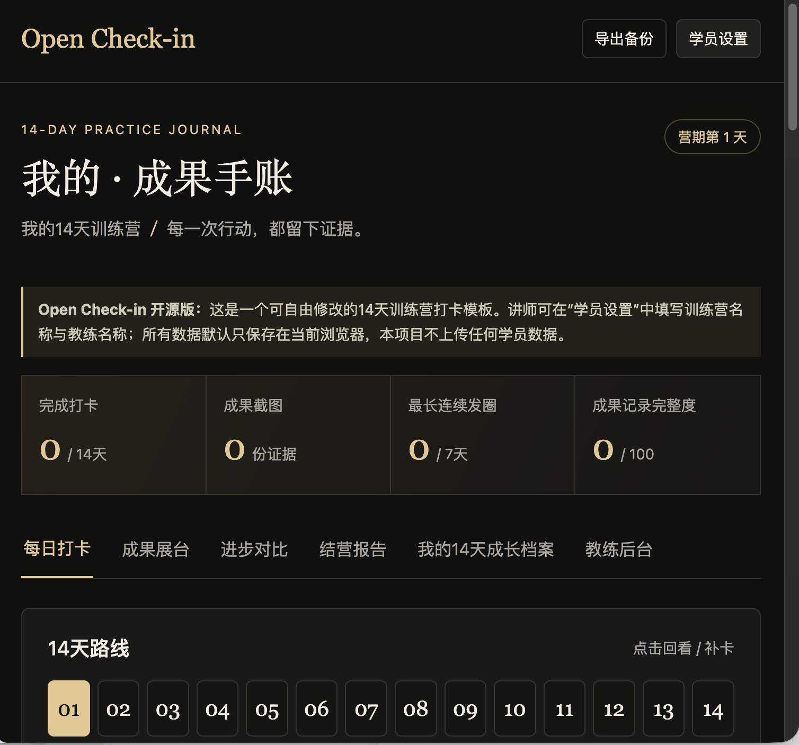
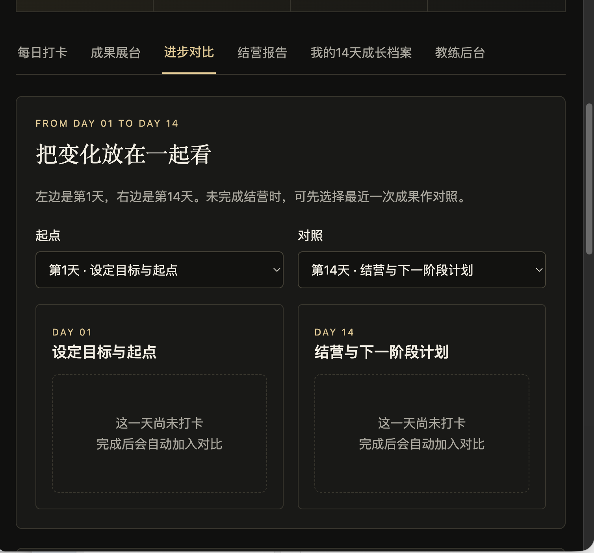
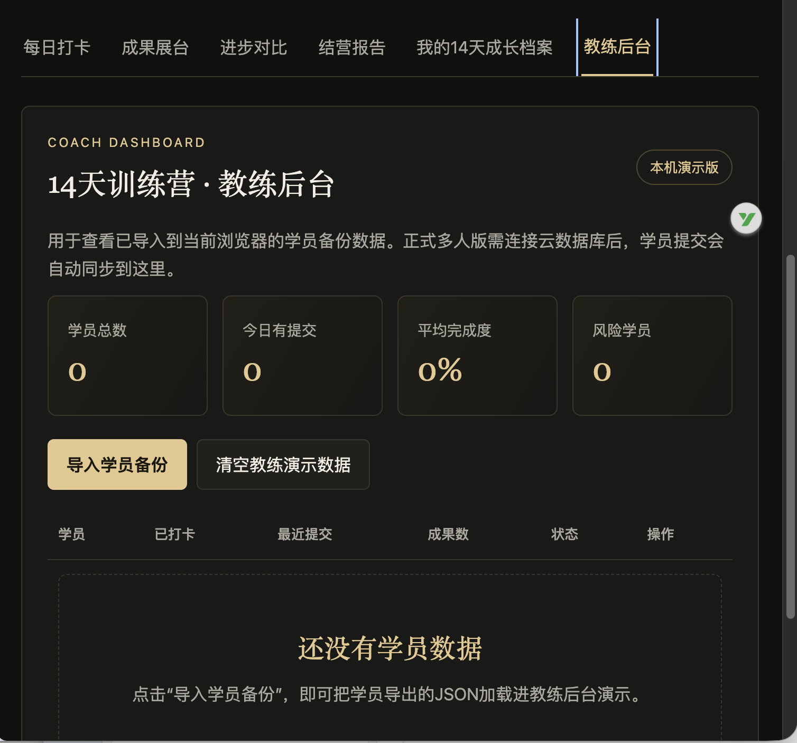

# Open Check-in

一个面向讲师、教练、训练营和学习社群的开源 14 天打卡与成长追踪系统。

**Open Check-in** helps educators turn a training program into a structured learning journey with daily check-ins, evidence collection, progress comparison, learner archives and coach review.

## 🚀 Live Demo

**[Try Open Check-in Online](https://yangnanyy1314-coder.github.io/open-checkin/)**

No installation is required for the demo. The current version is local-first: learner data is stored in the browser and is not uploaded by the project.

## 📸 Screenshots

### Daily check-in dashboard

### Progress comparison

### Coach dashboard

## ✨ Features

- 14-day learning and practice tracker
- Daily check-in and reflection
- Learning goal and progress tracking
- Result and screenshot submission
- Personal achievement gallery
- Day 1 → Day 14 progress comparison
- Learner growth archive
- Coach dashboard
- Automatic completion report
- Backup and restore
- Local-first browser storage
- Mobile-friendly interface
- Customizable program, coach, learner and learning goals

## 🎯 Who is it for?

Open Check-in can be adapted for:

- AI training programs
- Coaching programs
- Creator and content bootcamps
- Language learning
- Professional skills training
- Learning communities
- Personal growth challenges

## 🤖 AI-native customization

The repository includes a reusable prompt in `prompts/customize-with-ai.md`.

Non-technical educators can describe their training program, learners, goals, daily tasks and preferred style, then use AI coding tools such as Codex to adapt the template.

The goal is to make a practical training-management tool easier to reuse even for people without a traditional software-development background.

## 🧩 Quick Start

1. Download or clone this repository.
2. Open `index.html` in a modern browser.
3. Click **学员设置**.
4. Enter the training program name, coach name, learner name, start date and learning goal.
5. Start the daily check-in workflow.

For a hosted version, GitHub Pages can serve the project directly from the repository root.

## 🔐 Data & Privacy

The current public version is local-first.

- Check-in data is stored in the current browser.
- The project does not automatically upload learner data.
- Learners can export backups.
- Coach demo data can be imported from learner backup files.

Anyone adding a cloud backend should clearly document data handling and obtain appropriate learner consent.

## 🗺️ Roadmap

Current development ideas are tracked through GitHub Issues, including:

- Configurable 7 / 14 / 21 / 30-day programs
- Optional cloud database support
- AI-assisted learning progress reports
- Student and coach accounts
- Multi-course management
- Community achievement gallery
- More reusable training templates

## 📚 Documentation

- `docs/getting-started.md` — getting started guide
- `docs/customization.md` — customization guide
- `prompts/customize-with-ai.md` — reusable AI customization prompt

## 🤝 Contributing

Issues, suggestions and pull requests are welcome.

If you find a bug or have an idea for a reusable training workflow, open an Issue and describe the use case.

## 📄 License

MIT License. See `LICENSE`.

---

Built as an open-source experiment in making practical learning workflows easier to customize, reuse and improve with AI-assisted coding.
